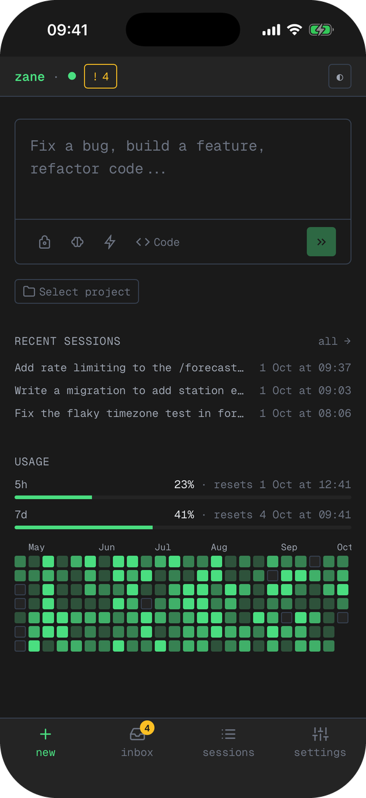
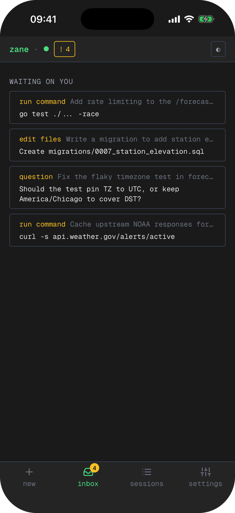
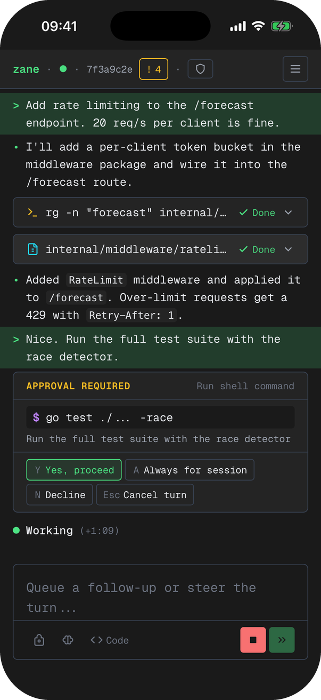

# Zane

Zane lets you monitor and control [Codex CLI](https://github.com/openai/codex) sessions running on your Mac from your phone, tablet, or any browser. Start tasks, watch real-time output, approve file writes, and review diffs from a handheld web client while your agent runs locally.

<p>
  
  
  
</p>

## Features

- **Start tasks remotely** -- kick off Codex sessions from your phone
- **Live streaming** -- watch agent output, reasoning, and diffs in real-time
- **Approve or deny** -- handle permission prompts from anywhere
- **Review diffs** -- inspect code changes per turn before they land
- **Plan mode** -- review and approve plans before the agent writes code
- **Push notifications** -- get notified on your phone for approvals and important session events
- **No port forwarding** -- Anchor connects outbound to Cloudflare; no open ports on your Mac
- **Passkey auth** -- WebAuthn passkeys, no passwords
- **Self-host first** -- run Orbit and Pages in your own Cloudflare account

## How it works

```
   Phone / Browser
         |
         | HTTPS + WebSocket
         ↓
   Orbit (Cloudflare Workers)
         ↑
         | WebSocket
         ↓
   Anchor (local daemon)
         |
         | JSON-RPC over stdio
         ↓
   Codex app-server
```

**Anchor** is a lightweight daemon on your Mac that spawns `codex app-server` and relays structured JSON-RPC messages. **Orbit** is a Cloudflare Worker + Durable Object that handles passkey auth, push notification fan-out, and WebSocket relay between your devices and Anchor. The **web client** is a static Svelte app on Cloudflare Pages.

## Quick start

### Requirements

- macOS (Apple Silicon or Intel)
- [Bun](https://bun.sh) 1.2 or later (`bun upgrade` to update)
- [Codex CLI](https://github.com/openai/codex) installed and authenticated

### Install

```bash
curl -fsSL https://raw.githubusercontent.com/cospec-ai/zane/main/install.sh | bash
```

The installer now prompts whether to run self-host deployment immediately or skip and run it later.

### Run

```bash
zane start
```

If you skipped deployment during install, run:

```bash
zane self-host
zane start
```

On first run:

1. A device code appears in your terminal.
2. A browser window opens for authentication.
3. You sign in with your passkey.
4. Anchor connects to Orbit and is ready for commands from the web client.

This path deploys and uses your own Cloudflare account, and is the current generally available setup. Managed Orbit access is currently waitlist-only.

## Local Mode (No Cloudflare)

If your devices are on a trusted private network (e.g., Tailscale, WireGuard, or LAN), you can skip Cloudflare entirely and connect directly to Anchor.

```
   Phone / Browser
         |
         | WebSocket (no auth)
         ↓
   Anchor (local daemon)
         |
         | JSON-RPC over stdio
         ↓
   Codex app-server
```

### Setup

**If you installed via the install script and skipped self-host deployment:**

1. In one terminal, start Anchor:

   ```bash
   zane start
   ```

2. In a second terminal, start the web UI:

   ```bash
   cd ~/.zane && bun dev -- --host 0.0.0.0
   ```

3. Find your Mac's IP address:

   ```bash
   ipconfig getifaddr en0
   # or your Tailscale IP: tailscale ip -4
   ```

4. On your phone or tablet, open `http://<your-mac-ip>:5173`.

5. In Settings, set the Anchor URL to `ws://<your-mac-ip>:8788/ws`.

**If you are working from the source repo:**

1. Start Anchor:

   ```bash
   cd services/anchor && bun install
   ANCHOR_ORBIT_URL="" bun run dev
   ```

2. In a second terminal, start the web UI from the repo root:

   ```bash
   bun install && bun dev -- --host 0.0.0.0
   ```

3. Find your IP, then open `http://<your-ip>:5173` on your phone and set the Anchor URL to `ws://<your-ip>:8788/ws` in Settings.

Local mode activates automatically when no `AUTH_URL` is configured — no sign-in required.

### When to use local mode

- **Tailscale / WireGuard** — devices on encrypted mesh network
- **Local development** — testing without Cloudflare deployment
- **Air-gapped environments** — no external network access

> **Security note:** Local mode has no authentication. Only use on networks you trust.

## CLI

| Command | Description |
|---------|-------------|
| `zane start` | Start the Anchor service |
| `zane login` | Re-authenticate |
| `zane doctor` | Check prerequisites and configuration |
| `zane config` | Open `.env` in your editor |
| `zane update` | Pull latest and reinstall |
| `zane self-host` | Deploy to your own Cloudflare account |
| `zane uninstall` | Remove Zane |

## Documentation

| Doc | Description |
|-----|-------------|
| [Installation](docs/installation.md) | Detailed install and setup guide |
| [Self-Hosting](docs/self-hosting.md) | Deploy to your own Cloudflare account |
| [Architecture](docs/architecture.md) | System design, components, and data flows |
| [Auth](docs/auth.md) | Passkey authentication and JWT details |
| [Events](docs/events.md) | JSON-RPC protocol reference |
| [Security](docs/security.md) | Threat model and security controls |
| [Repo Structure](docs/repo-structure.md) | Project directory layout |
| [Vision](docs/vision.md) | Product vision and design principles |

## Contributing

Contributions are welcome. Please open an issue first to discuss what you'd like to change.

## License

[MIT](LICENSE)
